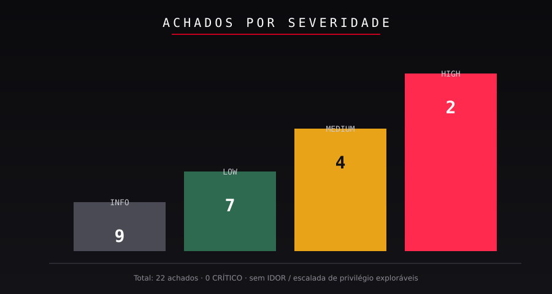

# Avaliação de Segurança em API — Projeto de Portfólio

> **Teste de penetração autorizado · API REST (Go / Gin) · SaaS de delivery de comida**
> Esta é uma **edição pública sanitizada** — todos os dados do cliente, hostnames,
> identificadores e segredos foram removidos. O relatório original é confidencial.

---

## Resumo

| Métrica | Valor |
|---------|-------|
| Escopo | 130 rotas / 140 máx., 3 perfis de role |
| Achados | 22 (0 Crítico · 2 High · 4 Medium · 7 Low · 9 Info) |
| Maior severidade | HIGH 8.8 (escalada vertical de privilégio) · HIGH 8.1 (duplicação massiva de CNPJ) |
| Controles fortes | Integridade de JWT, RBAC/sem IDOR, upload com validação por decode, CORS, TLS 1.3, rate limit |
| Entregável | [report.pdf](report.pdf) — relatório premium de 25 páginas |

**Os dois achados High são regras de *negócio* ausentes, não bugs de framework** — nenhum
scanner os encontraria. Esse é o coração deste portfólio.

---

## Conteúdo

| Arquivo / Pasta | O que é |
|-----------------|---------|
| [`report.pdf`](report.pdf) | Relatório premium de 25 páginas (exec summary → roadmap de hardening) |
| [`findings/`](findings/) | 22 cards de achados + registro de severidade (CVSS/CWE/OWASP/ATT&CK) |
| [`evidence/`](evidence/) | Trechos sanitizados de requisição/resposta canônicos |
| [`assets/`](assets/) | 10 diagramas customizados (arquitetura, superfície de ataque, JWT flow, risk matrix…) |
| [`methodology.md`](methodology.md) | Como o assessment foi planejado e executado |
| [`timeline.md`](timeline.md) | Linha do tempo do engajamento + lacunas de cobertura honestas |
| [`tools.md`](tools.md) | Racional de ferramentas (curl, OpenSSL, ffuf, Nuclei) + o que NÃO foi usado |
| [`hardening-roadmap.md`](hardening-roadmap.md) | 24 ações priorizadas com donos e janelas |
| [`portfolio-notes.md`](portfolio-notes.md) | Revisão sênior do relatório original + lições aprendidas |

---

## O Engajamento (sanitizado)

- **Alvo:** API REST multi-tenant de SaaS de delivery construída com **Go / Gin**.
- **Modelo:** híbrido — white-box (inventário de rotas no código-fonte) + black-box (teste em runtime).
- **Autorização:** documento formal de autorização de pentest; três credenciais de role
  (customer, store_owner, admin); sem dados reais; limpeza ao final.
- **Data do teste:** 2026-08-29.

### Inventário de rotas (do código-fonte, validado em runtime)

| Grupo | Rotas | Auth | Exemplos |
|-------|-------|------|----------|
| Infra | 4 | nenhuma | `/health` |
| Auth | 7 | pública | `/login/{role}`, `/auth/refresh` |
| OAuth | 0–10 | pública | Google / Apple (env-gated) |
| Catálogo | ~21 | JWT opcional | `/cuisines`, `/stores`, menus, itens |
| Protegido JWT | ~70 | obrigatória | pedidos, favoritos, endereços, cupons |
| Admin | 13 | role admin | `/admin/dashboard`, usuários, lojas |
| Webhooks | 2 | assinatura | `/webhooks/billing`, `/webhooks/{id}` |

---

## Resumo dos Achados

### Distribuição por severidade

### HIGH — prioridades 1 e 2

| ID | Achado | CVSS | Causa raiz |
|----|--------|------|------------|
| [F-01](findings/F-01.md) | Escalada vertical de privilégio via auto-registro de loja | 8.8 | Sem gate de role no `POST /store` |
| [F-02](findings/F-02.md) | Duplicação massiva de CNPJ (paralelo) | 8.1 | Sem `UNIQUE(cnpj)` e sem lock |

### MEDIUM — prioridades 3–6

| ID | Achado | CVSS |
|----|--------|------|
| [F-03](findings/F-03.md) | XSS armazenado (candidato) — condicional ao render do front | 5.4 |
| [F-04](findings/F-04.md) | 500 descontrolado em null-byte / payload grande | 6.5 |
| [F-05](findings/F-05.md) | 500 não tratado em `menu/category` e lookup admin | 5.3 |
| [F-06](findings/F-06.md) | Rate limit ausente na criação de loja | 5.3 |

### LOW & INFO
F-07 oráculo de existência em webhook · F-08 webhook fail-open · F-09 pedido idempotente
silencioso · F-10 catálogo ignora JWT inválido · F-11 rate limit depende de Redis ·
F-12 inconsistência de nomenclatura de role · F-13 3 headers de segurança ausentes ·
F-14 API exposta sem edge WAF · F-15 `POST /store` como customer retorna 400 em vez de 403 ·
F-16 customer pode pedir na própria loja · F-17 grupos internos visíveis · F-18 strings
tipo path traversal em name · F-19 nome de 1 char aceito · F-20 delete de avatar idempotente ·
F-21 XFF/Host sem bypass (**positivo**) · F-22 ffuf/Nuclei não acharam mais nada (**positivo**).

Registro completo: [`findings/severity-summary.md`](findings/severity-summary.md)

---

## Controles Validados (o que se sustentou)

Um assessment tem duas metades: encontrar o que está quebrado e **provar o que funciona**.
Cada controle abaixo foi ativamente atacado e se sustentou.

- **Integridade de JWT** — `alg:none`, claims adulteradas e tokens expirados → todos `401`.
- **RBAC & propriedade** — 20+ tentativas cross-role/cross-objeto → todas `403`. Sem IDOR/BOLA.
- **Upload** — SVG, HTML, PNG falso, polyglot, null-byte, traversal → todos `400` (o servidor
  *decodifica* a imagem, não apenas os magic bytes).
- **CORS** — sem reflexão de origin; `Origin` não permitida → `403`.
- **Transporte** — TLS 1.3, HSTS, CSP `default-src 'none'`, XFO DENY.
- **Rate limit (auth)** — 10/min; spoof de XFF não burlou (F-21).
- **Sem roteamento por Host-header** — `Host: evil.com` → `404` (F-21).
- **Idempotência** — 10× paralelos em favoritos/pedidos → um único favorito / um único pedido (F-09).
- **Automação** — ffuf + Nuclei não encontraram exposição adicional (F-22).

---

## Por que este repositório se destaca

1. **Achados de lógica de negócio, não output de scanner.** Os dois HIGHs são regras de
   negócio ausentes (gate de role, unicidade) provadas com testes de race condition.
2. **Controles positivos são primeira-classe.** Resultados negativos são documentados como
   defesas verificadas, não como "nada encontrado".
3. **Sanitizado e profissional.** Um relatório público completo e seguro para NDA, com um
   roadmap de hardening acionável de 7/30/60/90 dias.
4. **Honesto sobre lacunas.** "Não testado neste ciclo" é listado explicitamente
   (`timeline.md`) — credibilidade acima de reivindicar 100%.

---

## Política de sanitização

Removido/mascarado em todo arquivo: nomes de produto e empresa, hostnames reais, IPs, CNPJs,
emails, UUIDs, valores de JWT, segredos, IDs de requisição. Preservado: formatos HTTP, códigos
de status, mensagens de erro, categorias de payload, padrões de tempo/ordem — a substância técnica.

---

*Contato para a história completa, discussão em entrevista ou colaboração: veja o perfil do
repositório. O relatório original do engajamento permanece confidencial sob NDA.*